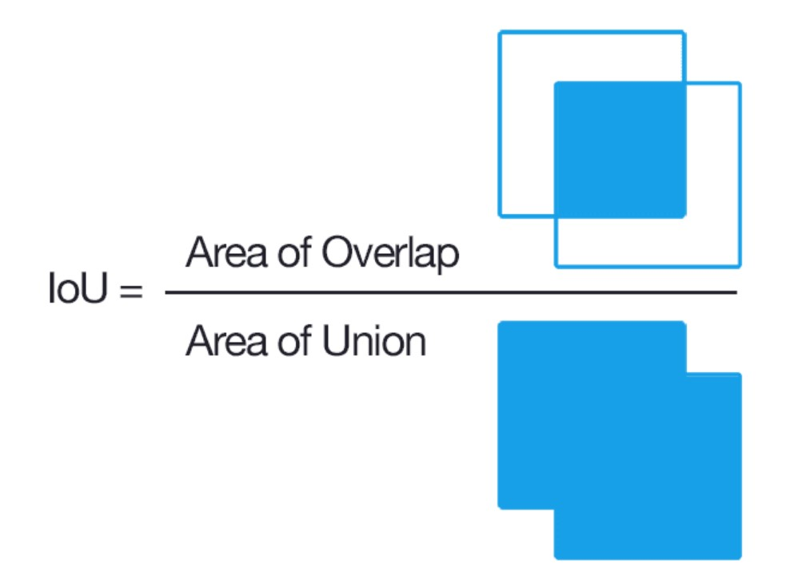
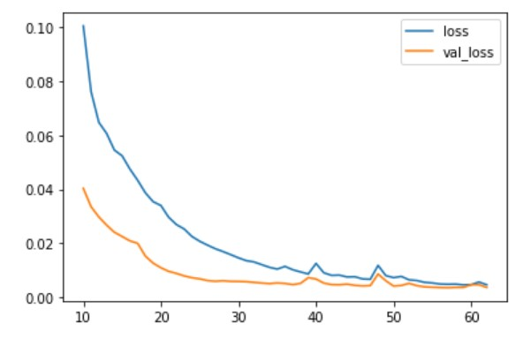
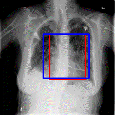

# Heart_Detection

# Pneumonia_Classification

### Project Summary:
My goal is to build an Object Detection model that can identify the location of a heart from X-Ray images. 
The performance of the model will be evaluated with the Intersection of Union (IoU) metric with a threshold of 0.5. 
For more information on IoU, I highly recommend you check out PyImageSearch’s article listed below.  
https://www.pyimagesearch.com/2016/11/07/intersection-over-union-iou-for-object-detection/

### Data Source:
RSNA Pneumonia Detection Challenge 
(https://www.kaggle.com/c/rsna-pneumonia-detection-challenge)

### Project Steps:
Step-1:
Extract bounding boxes labels from the given csv file and images from dicom files.

Step-2:
Use Imgaug to create augmented images with associated new bounding boxes. 
In addition to the augmentation pipeline, I challenge myself to create a more efficient data consumption pipeline by saving labels and images into TF-Records.
 
<b>Note: Saving Data into TF-Record can not only save your storage space up to 70%~80% but also it is said to make training faster in the TensorFlow Eco-system.</b>

Step-3:
Reading data from from disk and parsing data with tf.io functions.

Step-4:
Using the same ResNet50 model from the previous Pneumonia Classification Project. A small adjustment was made in the prediction layer where the output neurons became 4.
 
<b>Note: the blue bounding boxes are the ground truth, while the red bounding boxes are the predicted one.</b>

### Results:
#### Accuracy:
Number of predictions where iou > threshold(0.5): 22
Number of predictions where iou < threshold(0.5): 10

#### Loss:

#### GIF Result for ResNet50 (self-built model)

#### GIF Result for TF Object Detection API:
